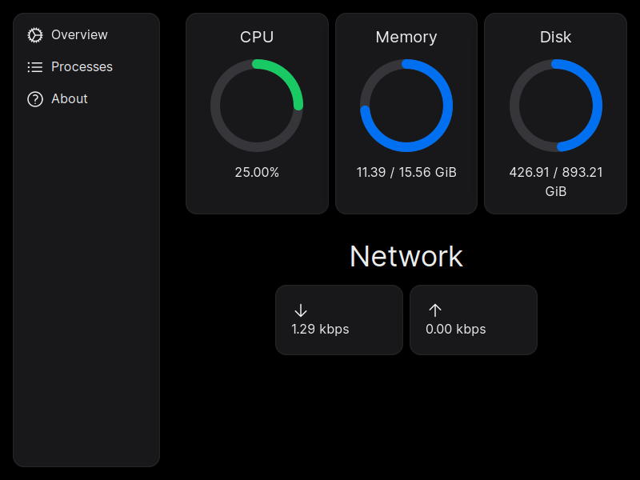
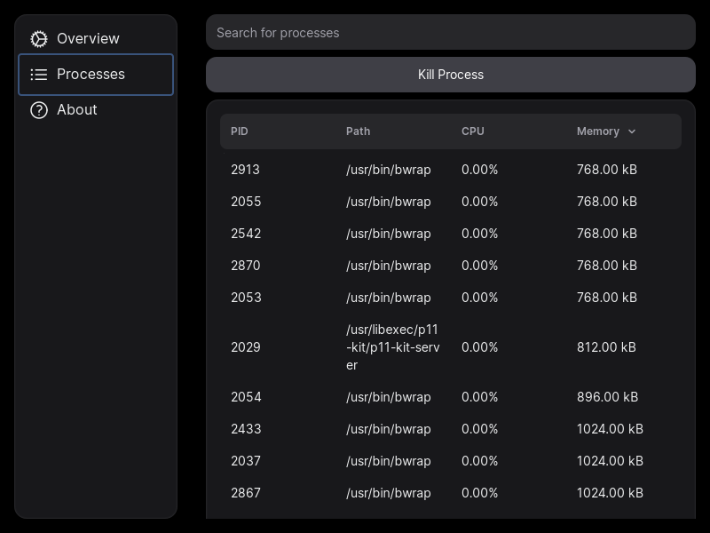
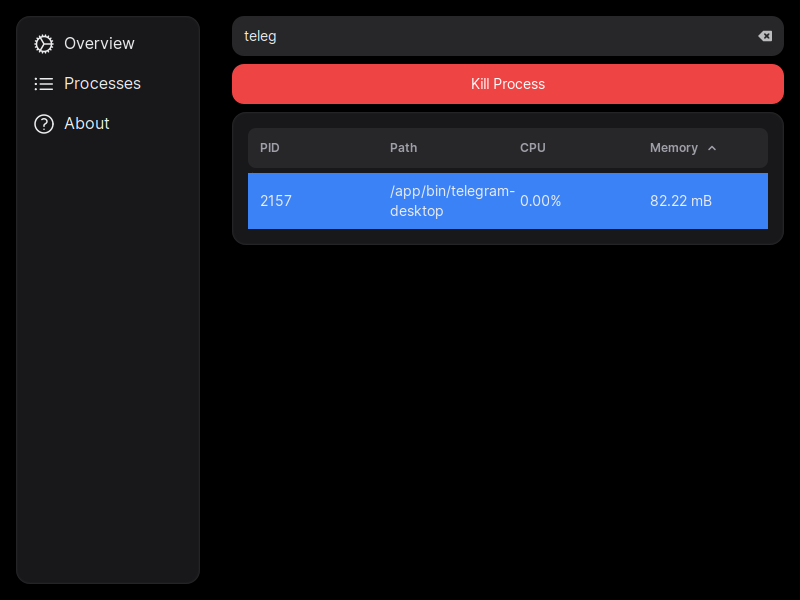
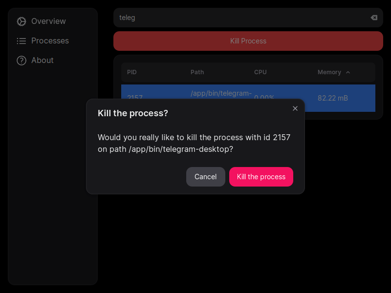

<div align="center">
    
</div>

<h1 align="center">Omniscient</h1>

<div align="center">
    
    
</div>

<p align="center">Omniscient is a process manager app powered by Tauri.</p>

Omniscient is not designed for everyday use from the get-go and is forever an alpha/beta software. The whole purpose of this app is to study Tauri. You are welcome to study it and contribute.

## Download

See [the latest release](https://github.com/erayerdin/omniscient/releases/latest) to download the app.

The app is distributed in various formats for all major platforms:

 - `deb` package for Debian-based (Debian, Ubuntu, Linux Mint etc.)
 - `AppImage` package for non-Debian Linux distros (Arch Linux, Fedora etc.)
 - `dmg` package for MacOS
 - `msi` and `exe` installers for Windows

The app is mainly tested on Linux. There might be inconsistencies and bugs on other platforms. If you encounter any weird behavior, kindly report.

The installers are not signed, so you might get security warnings on Windows while installing the app.

## Project Structure and Conventions

`tree` commentary is as below:

```plain
.
├── assets // assets to be used in/for the app
│   └── brand // assets to be used in only README or stores (not bundled in the final binary)
├── src // frontend with Typescript and NextJS
│   ├── app // root page dir
│   │   ├── about // about page
│   │   │   ├── hooks.ts
│   │   │   └── page.tsx
│   │   ├── process-list // process list page
│   │   │   ├── components
│   │   │   ├── hooks.ts
│   │   │   └── page.tsx
│   │   ├── components // the components used for root page
│   │   ├── hooks.ts // the hooks for root page
│   │   ├── layout.tsx // the layout of all app
│   │   └── providers.tsx // providers to be injected on component tree throught all app
│   │   ├── page.tsx // root page
│   ├── components // global components for whole app
│   │   ├── icons // icons (from heroicons)
│   └── shared // shared/common code
│       └── types.ts // shared types to be deserialized from Tauri
├── src-tauri // Rust and Tauri side
│   ├── src
│   │   ├── commands // Tauri commands
│   │   ├── main.rs // where Tauri commands are registered
│   │   ├── models // models to serialize command results
│   │   ├── states // shared state for whole process
│   └── tauri.conf.json // tauri config
```

### Structure of Frontend

Every page directory definitely has `page.tsx` to register on NextJS router.

Every page might have those:

 - `components` directory for local components specific to that page
 - `hooks.tsx` for custom hooks
 - `layout.tsx` for the layout of the page

Global components (which are used throughout the app) are located under `/src/components`.

Global shared code (such as shared types to deserialize into) are located under `/src/shared/types.ts`.

Only the pages are written as regular functions (`rfce` snippet) while all other components are written as anonymous arrow functions (`rafce` snippet).

### Structure of Rust-side

Commands are written under isolated _public_ submodules under `/src-tauri/src/commands` directory. They must always be public and prepended with `#[tauri::command]` macro.

After they are written, they must be registered inside `main.rs`.

If they expose anything other than primitive types (such as a struct instance), it must be created as a model under a submodule inside `/src-tauri/src/models`. These models must be prepended with `#[derive(Debug, Serialize)]` (`Debug` for logging, `Serialize` to serialize and send to frontend) and `#[serde(rename_all = "camelCase")]` since camelCase is convenient on Typescript side.

Since it is expensive to initialize [System](https://docs.rs/sysinfo/latest/sysinfo/struct.System.html) each time a command is invoked from the frontend, it is registered as a shared state in [main.rs](https://github.com/erayerdin/omniscient/blob/e102bd20e38472729ef6c00b36c705820d5b29f9/src-tauri/src/main.rs#L21). `System` is wrapped inside [SystemState](https://github.com/erayerdin/omniscient/blob/0467feb7e541d601dbfd4cb56c65526deccdb58c/src-tauri/src/states/system.rs#L11). It is a wrapper for `Arc<RwLock<System>>`. It is wrapped in `RwLock` because [refresh methods](https://docs.rs/sysinfo/latest/sysinfo/struct.System.html?search=refresh) in `*Ext` traits require mutable reference to cache system information inside `System`. It is also wrapped in `Arc` to send it to frontend side concurrently and safely.

 > [!NOTE]
 > One might ask `Mutex` could be used instead of `RwLock`. However, `Mutex` locks the inner state regardless its mutability. As Tauri works with IPC and utilizes message-passing between frontend and middle process concurrently, this leads to locks, thus performance bottlenecks. `RwLock`, on the other hand, provides infinite read access to its inner state while locks it when write access is required.

So, when a command requires an instance of `System`, it should access it from the parameter signatured `system_state: tauri::State<SystemState>`, then lock it to get inner `System` instance, generally as such:

```rust
let system = system_state
    .inner()
    .0 // System instance
    .read() // or `write` if write access is required
    .map_err(|_| OmniscientError::RwLockError)?; // convert to built-in error
```

## Screenshots






## Technologies

 - Rust
 - Tauri
 - Typescript
 - NextJS
 - [NextUI](https://nextui.org/) as UI library
 - [sysinfo](https://docs.rs/sysinfo/) for system information